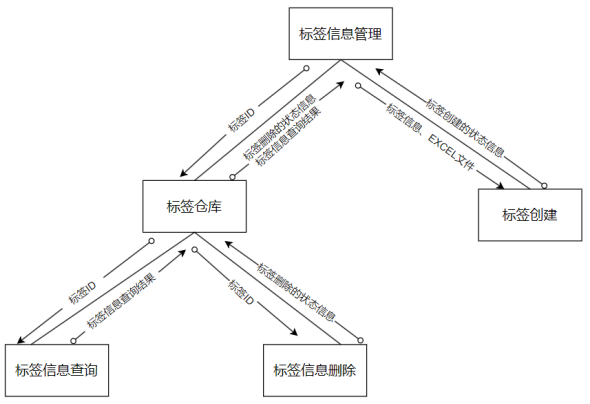
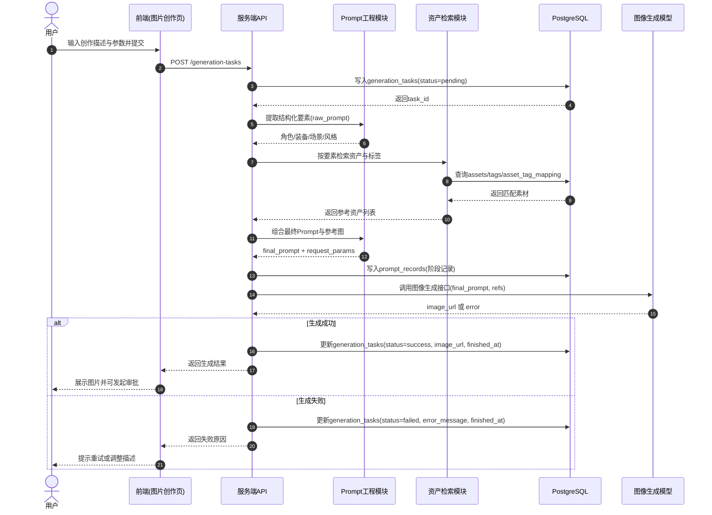

# 面向游戏美术团队的图像生成管理系统设计与实现

系统面向游戏美术团队，覆盖从创意输入、多模态对话、生成执行到作品沉淀、协作审批与空间治理的完整工作流。
---

系统主要功能模块（与侧栏导航一致）包括：

* **我的作品**：从服务端拉取已成功完成的生成记录，以卡片网格展示封面图、Prompt 与创建时间，便于快速回顾个人产出（与「图片创作 / 任务管理」中的成功结果衔接）。
* **任务管理**：记录每次生成任务的提交内容、模型参数、中间 Prompt 与最终结果，支持按状态检索与追溯，为排障、复盘与版本对比提供依据。
* **成员管理**：维护团队成员、角色与访问范围，保障创作数据与资产在工作空间内的可见性与操作边界一致。
* **审批中心**：以列表与详情抽屉呈现待审、已通过、未通过等状态的评审项，支持按状态与关键字筛选、发起与处理审批流程，便于主美或负责人在统一入口完成把关。

核心流程（图片创作路径）为：用户输入 → 结合资产 → 构建 Prompt → 创建任务 → 调用 AI 生成 → 返回并记录结果；对话与作品、审批模块分别支撑前置构思、结果沉淀与合规把关。

---
## 图片生成功能时序图描述

该流程从用户提交创作需求开始，系统先创建生成任务并记录为 `pending`，随后进行要素提取、资产检索与 Prompt 优化；完成后调用图像模型生成图片，并将任务状态更新为 `success` 或 `failed`，最终将结果返回到前端用于展示与后续审批。

---
核心技术为 **Prompt Engineering**：
* 用户输入生成描述后，系统对输入进行结构化解析，提取角色、武器和场景等要素
* 在资产库中分别检索对应素材
* 优化提示词，生成包含风格、视觉特征和场景描述的 Prompt，并将相关资产图片作为参考图输入模型
* 调用接口生成最终图像

---
技术架构 : next.js + postbreSQL
