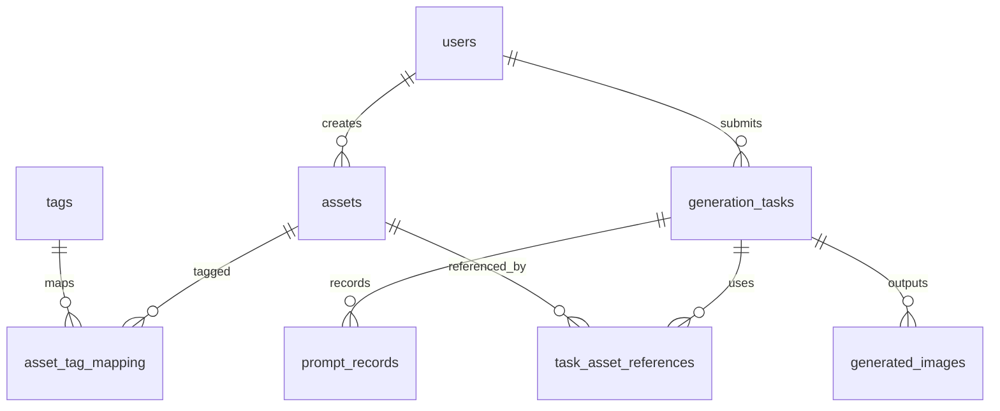

# 图像生成管理系统数据存储方案

## 总体表设计

最终设计为 7 张核心表：

| 表名 | 作用 |
| --- | --- |
| `users` | 系统用户表 |
| `assets` | 资产表，保存素材基本信息 |
| `tags` | 标签表，保存标签名称 |
| `asset_tag_mapping` | 资产与标签的多对多关系表 |
| `generation_tasks` | 图像生成任务表，保存一次完整生成请求 |
| `prompt_records` | 提示词处理记录表，保存两阶段 LLM 输出 |
| `task_asset_references` | 任务参考资产表，记录任务实际引用了哪些资产 |
| `generated_images` | 生成结果表，保存任务产出的图片 |

其中 `assets`、`tags`、`asset_tag_mapping` 三张表保留现有结构思路，仅做说明性完善，不做复杂拆分。

---

## 三、实体关系说明



关系理解如下：

- 一个 `asset` 可以被打多个 `tag`，一个 `tag` 也可以对应多个 `asset`。
- 一次 `generation_task` 会经历语义解析、Prompt 合成等步骤，因此需要 `prompt_records` 保存过程数据。
- 一次任务可能引用多个参考资产，也可能生成多张图片，因此分别设置 `task_asset_references` 和 `generated_images`。

---

## 四、数据表详细设计

### 4.1 `users` 用户表

用于保存系统登录用户信息与成员权限。

```sql
CREATE TABLE users (
    id              UUID PRIMARY KEY,
    username        VARCHAR(50) UNIQUE NOT NULL,
    password_hash   TEXT NOT NULL,
    display_name    VARCHAR(50),
    role            VARCHAR(20) NOT NULL DEFAULT 'member'
        CHECK (role IN ('admin', 'member')),
    created_at      TIMESTAMP DEFAULT CURRENT_TIMESTAMP
);
```

说明：

- `username` 用于登录，要求唯一。
- `display_name` 用于界面显示，可为空。
- `role` 仅区分 `admin` 和 `member` 两类权限，满足本科毕设中成员管理模块的基础需求。

### 4.2 `assets` 资产表

用于保存角色、武器、场景、风格参考图等素材信息。该表保留现有核心结构。

```sql
CREATE TABLE assets (
    id              UUID PRIMARY KEY,
    name            VARCHAR(100),
    type            VARCHAR(20)
        CHECK (type IN ('character', 'weapon', 'scene', 'style', 'other')),
    description     TEXT,
    preview_url     TEXT,
    embedding       VECTOR(1536),
    created_by      UUID REFERENCES users(id),
    created_at      TIMESTAMP DEFAULT CURRENT_TIMESTAMP
);
```

说明：

- `type` 用于进行基础分类，满足资产管理页面筛选需求。
- `description` 是资产文本描述，也是资产检索与 Prompt 增强的重要依据。
- `embedding` 为后续扩展语义检索预留，当前阶段可选用，不强制依赖。

### 4.3 `tags` 标签表

用于保存资产标签，如“龙骑士”“雪原”“赛博朋克”等。该表保留现有结构思路。

```sql
CREATE TABLE tags (
    id              UUID PRIMARY KEY,
    name            VARCHAR(50) UNIQUE NOT NULL
);
```

说明：

- 当前设计将标签作为全局字典管理，简化实现。
- 对于本科毕设而言，无需进一步拆分标签类别表。

### 4.4 `asset_tag_mapping` 资产标签关系表

用于建立资产与标签之间的多对多关系。该表保留现有结构。

```sql
CREATE TABLE asset_tag_mapping (
    asset_id        UUID NOT NULL REFERENCES assets(id) ON DELETE CASCADE,
    tag_id          UUID NOT NULL REFERENCES tags(id) ON DELETE CASCADE,
    PRIMARY KEY (asset_id, tag_id)
);
```

说明：

- 该表是实现“Tag 精准匹配”的核心。
- 与 `assets.description` 的模糊匹配共同组成算法设计中的两级检索策略。

### 4.5 `generation_tasks` 图像生成任务表

用于记录一次完整的图像生成任务，是任务管理模块的核心表。

```sql
CREATE TABLE generation_tasks (
    id              UUID PRIMARY KEY,
    user_id         UUID REFERENCES users(id),
    raw_prompt      TEXT NOT NULL,
    final_prompt    TEXT,
    model_name      VARCHAR(50),
    status          VARCHAR(20) NOT NULL DEFAULT 'pending'
        CHECK (status IN ('pending', 'processing', 'success', 'failed')),
    image_size      VARCHAR(20),
    request_params  JSONB,
    error_message   TEXT,
    created_at      TIMESTAMP DEFAULT CURRENT_TIMESTAMP,
    finished_at     TIMESTAMP
);
```

说明：

- `raw_prompt` 对应用户原始输入。
- `final_prompt` 对应 LLM 第二阶段合成后的最终提示词。
- `request_params` 用于保存尺寸、是否加水印、参考图数量等扩展参数，避免表设计过度复杂。
- `status` 支持前端任务列表展示与失败重试。

### 4.6 `prompt_records` 提示词处理记录表

用于记录提示词工程过程中的中间结果，对应 README 中的 `prompt_records`。

```sql
CREATE TABLE prompt_records (
    id                  UUID PRIMARY KEY,
    task_id             UUID NOT NULL REFERENCES generation_tasks(id) ON DELETE CASCADE,
    stage               VARCHAR(20) NOT NULL
        CHECK (stage IN ('extract', 'final', 'fallback')),
    prompt_text         TEXT,
    structured_result   JSONB,
    model_name          VARCHAR(50),
    created_at          TIMESTAMP DEFAULT CURRENT_TIMESTAMP
);
```

说明：

- `extract` 保存第一阶段语义解析结果。
- `final` 保存第二阶段合成 Prompt。
- `fallback` 用于记录模型失败时的本地降级结果。
- `structured_result` 使用 `JSONB` 保存结构化解析结果，适合存放 `{subject, equipment, scene, style}`。

### 4.7 `task_asset_references` 任务参考资产表

用于记录一次生成任务实际引用了哪些资产，便于后续回溯“生成结果受哪些资产影响”。

```sql
CREATE TABLE task_asset_references (
    id                  UUID PRIMARY KEY,
    task_id             UUID NOT NULL REFERENCES generation_tasks(id) ON DELETE CASCADE,
    asset_id            UUID NOT NULL REFERENCES assets(id),
    reference_type      VARCHAR(20) NOT NULL
        CHECK (reference_type IN ('subject', 'equipment', 'scene', 'style')),
    match_method        VARCHAR(20) NOT NULL
        CHECK (match_method IN ('tag', 'description')),
    reference_order     INT DEFAULT 0
);
```

说明：

- 该表对应算法设计中的资产检索结果。
- `reference_type` 表示该资产是作为主体、装备、场景还是风格参考被命中的。
- `match_method` 记录命中来源，便于论文中说明“Tag 精准匹配 + Description 模糊匹配”的实现过程。

### 4.8 `generated_images` 生成结果表

用于保存图像生成接口最终返回的图片结果。

```sql
CREATE TABLE generated_images (
    id              UUID PRIMARY KEY,
    task_id         UUID NOT NULL REFERENCES generation_tasks(id) ON DELETE CASCADE,
    image_url       TEXT NOT NULL,
    sort_order      INT DEFAULT 0,
    created_at      TIMESTAMP DEFAULT CURRENT_TIMESTAMP
);
```

说明：

- 一次任务可能返回多张图，因此单独拆表更合理。
- `sort_order` 用于控制前端展示顺序。

---

## 五、与算法流程的对应关系

系统完整流程与数据库落表关系如下：

1. 用户输入原始描述后，写入 `generation_tasks.raw_prompt`。
2. 第一阶段 LLM 语义解析结果写入 `prompt_records(stage='extract')`。
3. 资产检索命中的结果写入 `task_asset_references`。
4. 第二阶段 LLM 合成的最终 Prompt 写入 `prompt_records(stage='final')`，并同步写入 `generation_tasks.final_prompt`。
5. 调用生图接口后，将任务状态更新到 `generation_tasks.status`。
6. 返回图片结果后，保存到 `generated_images`。

这样可以保证“任务主表负责汇总状态，中间过程单独留痕，最终结果独立存储”，结构清晰且便于论文描述。

---

## 六、推荐索引设计

为保证常见查询性能，建议增加以下索引：

```sql
CREATE INDEX idx_assets_type ON assets(type);
CREATE INDEX idx_assets_created_at ON assets(created_at DESC);
CREATE INDEX idx_asset_tag_mapping_tag_id ON asset_tag_mapping(tag_id);
CREATE INDEX idx_generation_tasks_user_id ON generation_tasks(user_id);
CREATE INDEX idx_generation_tasks_status ON generation_tasks(status);
CREATE INDEX idx_prompt_records_task_id ON prompt_records(task_id);
CREATE INDEX idx_generated_images_task_id ON generated_images(task_id);
CREATE INDEX idx_task_asset_references_task_id ON task_asset_references(task_id);
```

说明：

- `asset_tag_mapping(tag_id)` 支持按标签反查资产。
- `generation_tasks(status)` 支持任务状态筛选。
- 其余索引主要服务于任务详情与结果回显。

---

## 七、方案总结

本方案相较于原始草案，主要改进如下：

1. 去掉了 `workspace` 相关设计，避免系统结构超出当前项目实现范围。
2. 将成员权限简化为 `users.role` 中的 `admin/member` 两级，便于实现和说明。
3. 保留 `assets`、`tags`、`asset_tag_mapping` 三张核心资产表结构，符合现有代码基础。

4. 将提示词处理过程拆分为 `generation_tasks + prompt_records`，既便于实现，又便于论文描述“两阶段 LLM”。
5. 增加 `task_asset_references` 与 `generated_images`，使“参考资产来源”和“生成结果”都可追踪。
6. 整体表数量控制在本科毕设可实现范围内，没有引入复杂审批流、版本库或过重的权限体系。

如果后续需要继续落地到代码层，可以在此方案基础上再同步更新 `prisma/schema.prisma`。
