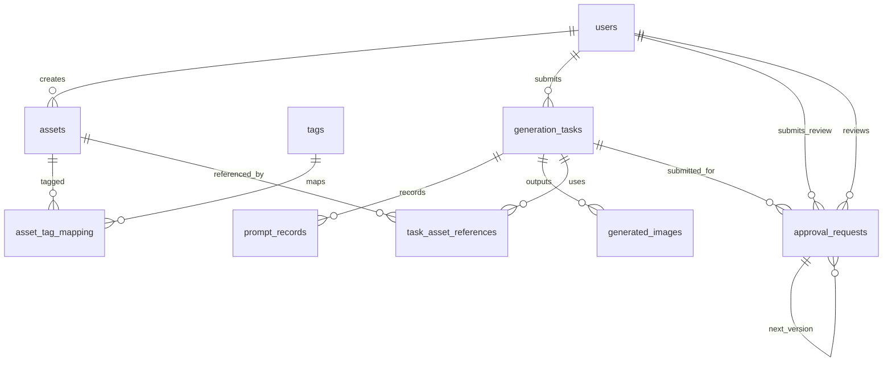

# 图像生成管理系统数据存储方案

## 总体表设计

最终设计为 9 张核心表：

| 表名 | 作用 |
| --- | --- |
| `users` | 系统用户表 |
| `assets` | 资产表，保存素材基本信息 |
| `tags` | 标签表，保存标签名称 |
| `asset_tag_mapping` | 资产与标签的多对多关系表 |
| `generation_tasks` | 图像生成任务表，保存一次完整生成请求 |
| `prompt_records` | 提示词处理记录表，保存两阶段 LLM 输出 |
| `task_asset_references` | 任务参考资产表，记录任务实际引用了哪些资产 |
| `generated_images` | 生成结果表，保存任务产出的图片 |
| `approval_requests` | 审批申请表，记录成员对生成结果发起的审批流程 |

其中 `assets`、`tags`、`asset_tag_mapping` 三张表保留现有结构思路，仅做说明性完善，不做复杂拆分。

---

## 三、实体关系说明



关系理解如下：

- 一个 `asset` 可以被打多个 `tag`，一个 `tag` 也可以对应多个 `asset`。
- 一次 `generation_task` 会经历语义解析、Prompt 合成等步骤，因此需要 `prompt_records` 保存过程数据。
- 一次任务可能引用多个参考资产，也可能生成多张图片，因此分别设置 `task_asset_references` 和 `generated_images`。
- 一次成功生成的任务可以发起多轮 `approval_requests`（每轮对应一次“提交 → 管理员审核”的循环），通过 `parent_request_id` 自引用形成 `v1 → v2` 的版本链，便于追溯修改原因与最终决策。

---

## 四、数据表详细设计

### 4.1 `users` 用户表

用于保存系统登录用户信息与成员权限。

```sql
CREATE TABLE users (
    id              UUID PRIMARY KEY,
    username        VARCHAR(50) UNIQUE NOT NULL,
    password_hash   TEXT NOT NULL,
    display_name    VARCHAR(50),
    role            VARCHAR(20) NOT NULL DEFAULT 'member'
        CHECK (role IN ('admin', 'member')),
    created_at      TIMESTAMP DEFAULT CURRENT_TIMESTAMP
);
```

说明：

- `username` 用于登录，要求唯一。
- `display_name` 用于界面显示，可为空。
- `role` 仅区分 `admin` 和 `member` 两类权限，满足本科毕设中成员管理模块的基础需求。

### 4.2 `assets` 资产表

用于保存角色、武器、场景、风格参考图等素材信息。该表保留现有核心结构。

```sql
CREATE TABLE assets (
    id              UUID PRIMARY KEY,
    name            VARCHAR(100),
    type            VARCHAR(20)
        CHECK (type IN ('character', 'weapon', 'scene', 'style', 'other')),
    description     TEXT,
    preview_url     TEXT,
    embedding       VECTOR(1536),
    created_by      UUID REFERENCES users(id),
    created_at      TIMESTAMP DEFAULT CURRENT_TIMESTAMP
);
```

说明：

- `type` 用于进行基础分类，满足资产管理页面筛选需求。
- `description` 是资产文本描述，也是资产检索与 Prompt 增强的重要依据。
- `embedding` 为后续扩展语义检索预留，当前阶段可选用，不强制依赖。

### 4.3 `tags` 标签表

用于保存资产标签，如“龙骑士”“雪原”“赛博朋克”等。该表保留现有结构思路。

```sql
CREATE TABLE tags (
    id              UUID PRIMARY KEY,
    name            VARCHAR(50) UNIQUE NOT NULL
);
```

说明：

- 当前设计将标签作为全局字典管理，简化实现。
- 对于本科毕设而言，无需进一步拆分标签类别表。

### 4.4 `asset_tag_mapping` 资产标签关系表

用于建立资产与标签之间的多对多关系。该表保留现有结构。

```sql
CREATE TABLE asset_tag_mapping (
    asset_id        UUID NOT NULL REFERENCES assets(id) ON DELETE CASCADE,
    tag_id          UUID NOT NULL REFERENCES tags(id) ON DELETE CASCADE,
    PRIMARY KEY (asset_id, tag_id)
);
```

说明：

- 该表是实现“Tag 精准匹配”的核心。
- 与 `assets.description` 的模糊匹配共同组成算法设计中的两级检索策略。

### 4.5 `generation_tasks` 图像生成任务表

用于记录一次完整的图像生成任务，是任务管理模块的核心表。

```sql
CREATE TABLE generation_tasks (
    id              UUID PRIMARY KEY,
    user_id         UUID REFERENCES users(id),
    raw_prompt      TEXT NOT NULL,
    final_prompt    TEXT,
    model_name      VARCHAR(50),
    status          VARCHAR(20) NOT NULL DEFAULT 'pending'
        CHECK (status IN ('pending', 'processing', 'success', 'failed')),
    image_size      VARCHAR(20),
    request_params  JSONB,
    error_message   TEXT,
    created_at      TIMESTAMP DEFAULT CURRENT_TIMESTAMP,
    finished_at     TIMESTAMP
);
```

说明：

- `raw_prompt` 对应用户原始输入。
- `final_prompt` 对应 LLM 第二阶段合成后的最终提示词。
- `request_params` 用于保存尺寸、是否加水印、参考图数量等扩展参数，避免表设计过度复杂。
- `status` 支持前端任务列表展示与失败重试。
### 4.7 `task_asset_references` 任务参考资产表

用于记录一次生成任务实际引用了哪些资产，便于后续回溯“生成结果受哪些资产影响”。

```sql
CREATE TABLE task_asset_references (
    id                  UUID PRIMARY KEY,
    task_id             UUID NOT NULL REFERENCES generation_tasks(id) ON DELETE CASCADE,
    asset_id            UUID NOT NULL REFERENCES assets(id),
    reference_type      VARCHAR(20) NOT NULL
        CHECK (reference_type IN ('subject', 'equipment', 'scene', 'style')),
    match_method        VARCHAR(20) NOT NULL
        CHECK (match_method IN ('tag', 'description')),
    reference_order     INT DEFAULT 0
);
```

说明：

- 该表对应算法设计中的资产检索结果。
- `reference_type` 表示该资产是作为主体、装备、场景还是风格参考被命中的。
- `match_method` 记录命中来源，便于论文中说明“Tag 精准匹配 + Description 模糊匹配”的实现过程。

### 4.8 `generated_images` 生成结果表

用于保存图像生成接口最终返回的图片结果。

```sql
CREATE TABLE generated_images (
    id              UUID PRIMARY KEY,
    task_id         UUID NOT NULL REFERENCES generation_tasks(id) ON DELETE CASCADE,
    image_url       TEXT NOT NULL,
    sort_order      INT DEFAULT 0,
    created_at      TIMESTAMP DEFAULT CURRENT_TIMESTAMP
);
```

说明：

- 一次任务可能返回多张图，因此单独拆表更合理。
- `sort_order` 用于控制前端展示顺序。

### 4.9 `approval_requests` 审批申请表

用于支撑“审批中心”模块：普通成员将已生成的任务提交给管理员审核，管理员给出通过 / 驳回及批注，驳回后成员可基于原申请重新发起，形成版本链。

```sql
CREATE TABLE approval_requests (
    id                  UUID PRIMARY KEY,
    task_id             UUID NOT NULL REFERENCES generation_tasks(id) ON DELETE CASCADE,
    submitter_id        UUID NOT NULL REFERENCES users(id),
    reviewer_id         UUID REFERENCES users(id) ON DELETE SET NULL,
    status              VARCHAR(20) NOT NULL DEFAULT 'pending'
        CHECK (status IN ('pending', 'approved', 'rejected')),
    submitter_note      TEXT,
    reviewer_note       TEXT,
    parent_request_id   UUID REFERENCES approval_requests(id) ON DELETE SET NULL,
    version             INT NOT NULL DEFAULT 1,
    created_at          TIMESTAMP DEFAULT CURRENT_TIMESTAMP,
    reviewed_at         TIMESTAMP
);
```

字段说明：

- `task_id`：绑定到 `generation_tasks`，即审批的“物料来源”。删除任务会级联清理历史审批。
- `submitter_id` / `reviewer_id`：分别对应“提交人”和“审核人”。审核人必须是 `role='admin'` 的用户，API 层做一次校验。
- `status`：`pending` / `approved` / `rejected` 三态，对应界面的 *待审核 / 已通过 / 未通过* 角标颜色。
- `submitter_note`：提交人填写的说明文字，可选；在“重新发起审批”场景下通常是“已根据意见调整提示词”等描述。
- `reviewer_note`：管理员批注。在 API 层强制要求：当 `status` 被更新为 `rejected` 时必须填写。
- `parent_request_id` + `version`：当同一任务被驳回后重新提交，新记录的 `parent_request_id` 指向被驳回的那一条，`version = parent.version + 1`。前端通过顺着链条回溯，将“提交→审核→再提交”拼装成一条 Timeline 展示。
- `reviewed_at`：管理员完成审核的时间戳，待审批时保持 `NULL`。

对应的业务约束由接口层保证：

1. 只能把审批提交给 `role='admin'` 的用户，且不允许提交给自己。
2. 只有被指派的 `reviewer_id` 才能对该条审批进行通过 / 驳回。
3. 只有 `rejected` 状态的审批才允许其提交人在原链上重新提交。
4. 驳回时 `reviewer_note` 必填，通过时 `reviewer_note` 可选。

---


### 4.10 核心实体关系说明

本系统可抽象为六个核心实体：**用户、资产、标签、任务、结果、审批**。其关系如下：

1. **用户（users） 与 任务（generation_tasks）**：`1:N`  
   一个用户可发起多条生成任务；每条任务只属于一个发起用户（允许在用户删除后置空外键）。

2. **用户（users） 与 资产（assets）**：`1:N`  
   一个用户可创建多条资产；资产记录创建人用于后续追溯和权限判断。

3. **资产（assets） 与 标签（tags）**：`N:M`  
   通过中间表 `asset_tag_mapping` 建立多对多关系：一个资产可打多个标签，一个标签也可被多个资产复用。

4. **任务（generation_tasks） 与 结果（generated_images）**：`1:N`  
   一次任务可能生成多张图片，因此结果独立成表，由 `generated_images.task_id` 关联任务主表。

5. **任务（generation_tasks） 与 审批（approval_requests）**：`1:N`  
   一条任务可对应多次审批申请（如驳回后重新提交），审批记录通过 `task_id` 归属到具体任务。

6. **用户（users） 与 审批（approval_requests）**：双 `1:N`  
   审批表中 `submitter_id` 表示提交人、`reviewer_id` 表示审核人；同一用户可提交多条审批，也可审核多条审批。

7. **审批（approval_requests） 自关联**：`1:N`  
   通过 `parent_request_id` 形成“上一版本审批 -> 新版本审批”的链式关系，用于表示 `v1/v2/v3` 的驳回重提过程。

综合来看，`generation_tasks` 是业务主线实体，向前关联用户输入与资产引用，向后关联生成结果与审批流程；`asset_tag_mapping` 与 `approval_requests.parent_request_id` 分别承担“多对多建模”和“版本链建模”两类关键关系。

## 五、与算法流程的对应关系

系统完整流程与数据库落表关系如下：

1. 用户输入原始描述后，写入 `generation_tasks.raw_prompt`。
2. 第一阶段 LLM 语义解析结果写入 `prompt_records(stage='extract')`。
3. 资产检索命中的结果写入 `task_asset_references`。
4. 第二阶段 LLM 合成的最终 Prompt 写入 `prompt_records(stage='final')`，并同步写入 `generation_tasks.final_prompt`。
5. 调用生图接口后，将任务状态更新到 `generation_tasks.status`。
6. 返回图片结果后，保存到 `generated_images`。
7. 用户在“审批中心”针对已成功的任务发起审批，写入 `approval_requests`；管理员通过或驳回时更新 `status`、`reviewer_note`、`reviewed_at`。
8. 驳回后用户选择“以此参数重新发起审批”，在 `approval_requests` 中再插入一条 `parent_request_id` 指向上一条的新记录，`version` 递增，形成 `v1/v2` 链。

这样可以保证“任务主表负责汇总状态，中间过程单独留痕，最终结果独立存储，审批流与生成链解耦”，结构清晰且便于论文描述。

---

## 六、推荐索引设计

为保证常见查询性能，建议增加以下索引：

```sql
CREATE INDEX idx_assets_type ON assets(type);
CREATE INDEX idx_assets_created_at ON assets(created_at DESC);
CREATE INDEX idx_asset_tag_mapping_tag_id ON asset_tag_mapping(tag_id);
CREATE INDEX idx_generation_tasks_user_id ON generation_tasks(user_id);
CREATE INDEX idx_generation_tasks_status ON generation_tasks(status);
CREATE INDEX idx_prompt_records_task_id ON prompt_records(task_id);
CREATE INDEX idx_generated_images_task_id ON generated_images(task_id);
CREATE INDEX idx_task_asset_references_task_id ON task_asset_references(task_id);
CREATE INDEX idx_approval_requests_submitter_id ON approval_requests(submitter_id);
CREATE INDEX idx_approval_requests_reviewer_id ON approval_requests(reviewer_id);
CREATE INDEX idx_approval_requests_status ON approval_requests(status);
CREATE INDEX idx_approval_requests_task_id ON approval_requests(task_id);
CREATE INDEX idx_approval_requests_parent_id ON approval_requests(parent_request_id);
```

说明：

- `asset_tag_mapping(tag_id)` 支持按标签反查资产。
- `generation_tasks(status)` 支持任务状态筛选。
- `approval_requests(reviewer_id, status)` 支持“待我审批”Tab 中的 `pending` 红点计数与筛选。
- `approval_requests(submitter_id)` 支持“我的提交”列表按时间倒序查询。
- 其余索引主要服务于任务详情与结果回显。

---

## 七、方案总结

本方案相较于原始草案，主要改进如下：

1. 去掉了 `workspace` 相关设计，避免系统结构超出当前项目实现范围。
2. 将成员权限简化为 `users.role` 中的 `admin/member` 两级，便于实现和说明。
3. 保留 `assets`、`tags`、`asset_tag_mapping` 三张核心资产表结构，符合现有代码基础。

4. 将提示词处理过程拆分为 `generation_tasks + prompt_records`，既便于实现，又便于论文描述“两阶段 LLM”。
5. 增加 `task_asset_references` 与 `generated_images`，使“参考资产来源”和“生成结果”都可追踪。
6. 新增 `approval_requests` 单表承载审批流：提交人/审核人 + 状态 + 批注 + 自引用版本链，既满足“我的提交 / 待我审批”双视图所需的筛选与计数，又通过 `parent_request_id` 记录“驳回 → 重新提交”的 `v1/v2` 关系，避免为审批独立再建多张表。
7. 整体表数量控制在本科毕设可实现范围内，没有引入复杂多级审批、版本库或过重的权限体系。

对应的代码落地位置：

- `prisma/schema.prisma`：`ApprovalRequest` 模型及其与 `User`、`GenerationTask` 的关联。
- `prisma/init.sql` / `prisma/seed.sql`：`approval_requests` 建表 DDL 与测试数据。
- `app/api/reviews/*`：审批列表、详情、通过/驳回、可提交任务、可选审核人等接口。
- `app/review/page.tsx`：审批中心页面（Tabs 双视图 + 列表 + 详情 Drawer + 提交 Modal）。
