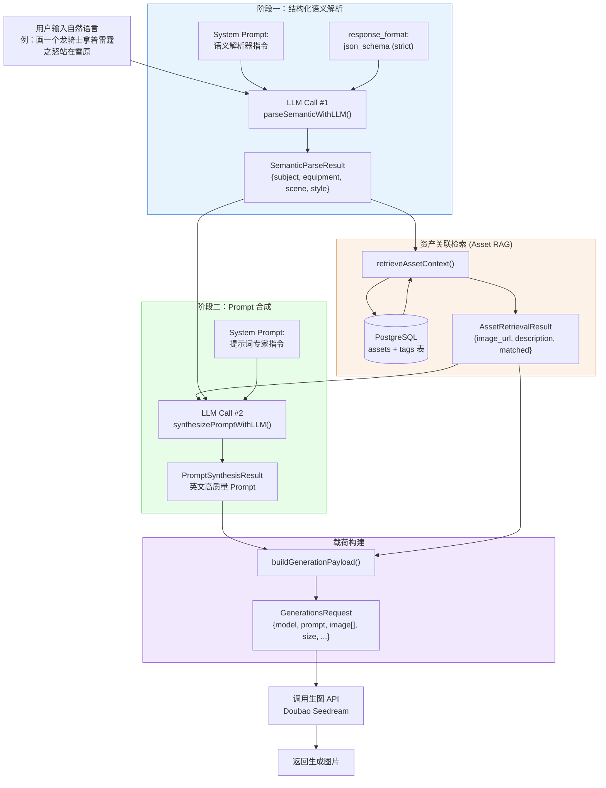
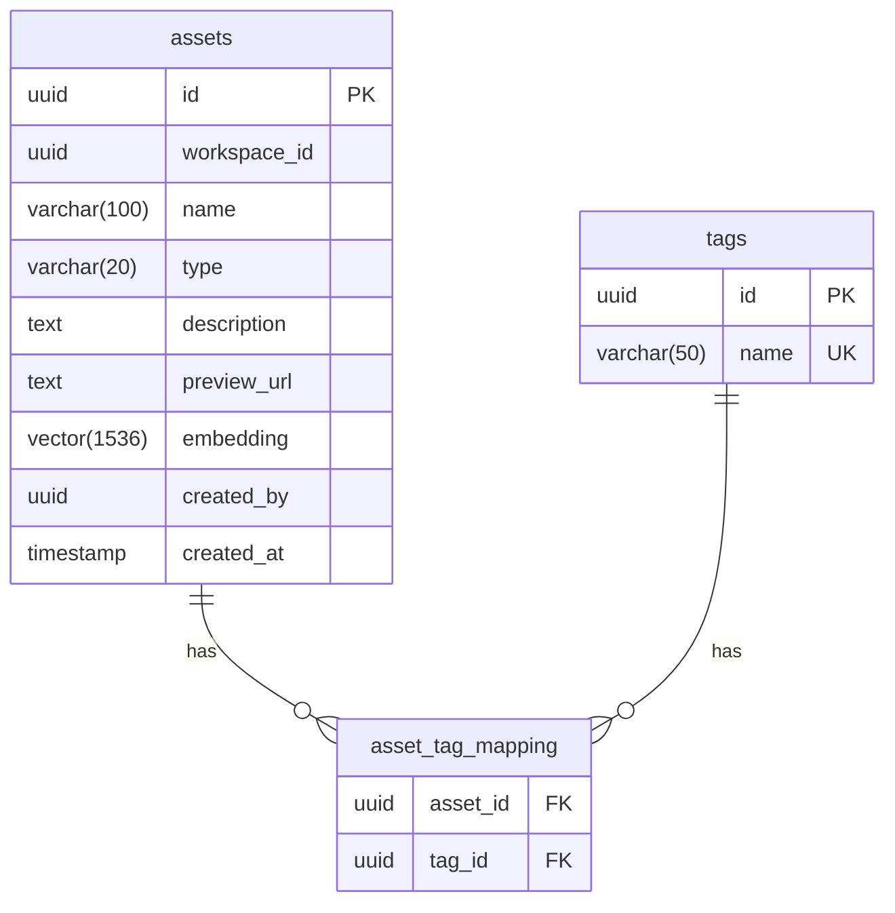
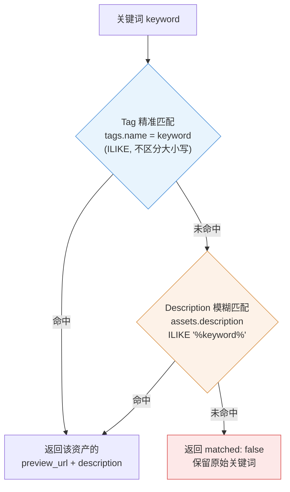
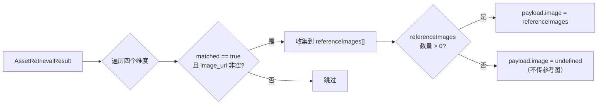
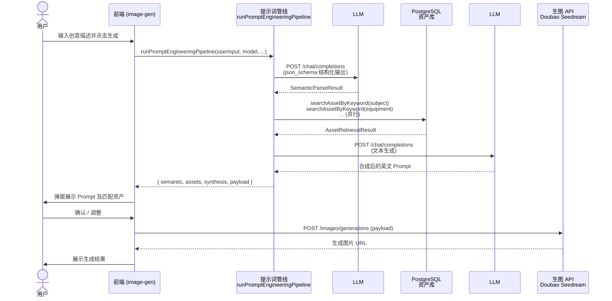

# 提示词工程算法设计：基于双阶段 LLM 的资产联动机制

## 一、算法总体思路

### 1.1 设计目标

将用户的**自然语言输入**转化为**结构化、高质量的图像生成提示词（Prompt）**，并结合项目资产库中的素材信息（角色设定、武器外观、场景描述等），实现生成结果的**可控性**与**风格一致性**。

### 1.2 核心机制

算法整体采用 **两阶段语言模型（LLM）调用 + 资产检索增强（Asset RAG）** 的串行流水线：

| 阶段            | 功能                   | 调用方式                                      |
| --------------- | ---------------------- | --------------------------------------------- |
| LLM Call #1     | 结构化语义解析         | Chat Completions + `json_schema` 结构化输出   |
| Asset RAG       | 资产关联检索           | PostgreSQL（Tag 精准 + Description 模糊）     |
| LLM Call #2     | 上下文感知 Prompt 合成 | Chat Completions 普通文本生成                 |
| Payload Build   | 多模态载荷构建         | 本地组装（Prompt + 参考图 URL）               |

### 1.3 总体流程图



---

## 二、阶段详细设计

### 2.1 第一阶段：结构化语义解析（LLM Call #1）

#### 目标

将用户输入的自然语言 $S_{user}$ 转化为机器可处理的结构化 JSON，提取四个关键维度。

#### API 调用方式

调用火山方舟 Chat Completions API，启用 **结构化输出（`response_format: json_schema`）** 以保证输出严格符合 Schema。

- **接口**：`POST https://ark.cn-beijing.volces.com/api/v3/chat/completions`
- **模型**：`doubao-pro-32k-240615`
- **温度**：`temperature: 0`（确保确定性输出）

#### JSON Schema 约束

```json
{
  "name": "semantic_parse",
  "strict": true,
  "schema": {
    "type": "object",
    "properties": {
      "subject":   { "type": ["string", "null"], "description": "主体/角色" },
      "equipment": { "type": ["string", "null"], "description": "装备/道具" },
      "scene":     { "type": ["string", "null"], "description": "场景/环境" },
      "style":     { "type": ["string", "null"], "description": "画面风格" }
    },
    "required": ["subject", "equipment", "scene", "style"],
    "additionalProperties": false
  }
}
```

#### System Prompt

> 你是一个语义解析器。请从用户输入中提取以下四个维度的信息：主体(subject)、装备(equipment)、场景(scene)、风格(style)。若用户未明确提及某一项，则该项设为 null。严格按照给定的 JSON Schema 输出 JSON，不要输出任何其他内容。

#### 输入输出示例

**输入**：`"画一个龙骑士拿着雷霆之怒站在雪原，写实油画风格"`

**LLM 输出**：

```json
{
  "subject": "龙骑士",
  "equipment": "雷霆之怒",
  "scene": "雪原",
  "style": "写实油画"
}
```

#### 语义解析伪代码

```text
FUNCTION parseSemanticWithLLM(userInput):
    messages ← [
        { role: "system", content: SEMANTIC_SYSTEM_PROMPT },
        { role: "user",   content: userInput.text }
    ]
    request ← {
        model:           "doubao-pro-32k-240615",
        messages:        messages,
        response_format: { type: "json_schema", json_schema: SEMANTIC_PARSE_SCHEMA },
        temperature:     0,
        stream:          false
    }

    response ← POST /api/v3/chat/completions (request)
    raw      ← response.choices[0].message.content

    IF raw IS EMPTY:
        RETURN { subject: null, equipment: null, scene: null, style: null }

    RETURN JSON.parse(raw)  // → SemanticParseResult
```

#### 解析容错机制

- API Key 未配置 → 返回全 `null` 空结构
- LLM 返回空内容 → 返回全 `null` 空结构
- LLM 调用异常（网络/超时） → 捕获异常，返回全 `null` 空结构
- 后续阶段仍可基于原始用户输入做本地 fallback

---

### 2.2 资产关联检索（Asset RAG）

#### 检索目标

根据第一阶段解析出的关键词，在 PostgreSQL 资产库中检索匹配的素材，获取其 **图片 URL**（`preview_url`）和 **视觉描述**（`description`），为 Prompt 合成提供上下文。

#### 数据模型



#### 检索策略（两级降级）

对语义解析出的每个非空关键词，执行如下检索逻辑：



#### 检索伪代码

```text
FUNCTION retrieveAssetContext(semantic):
    entries ← 过滤 semantic 中非 null 的维度

    // 并行查询所有关键词
    FOR EACH (key, keyword) IN entries PARALLEL:
        result[key] ← searchAssetByKeyword(keyword)

    RETURN result  // → AssetRetrievalResult

FUNCTION searchAssetByKeyword(keyword):
    // 第一优先级：Tag 精准匹配
    byTag ← SELECT id, name, description, preview_url
             FROM assets a
             JOIN asset_tag_mapping atm ON atm.asset_id = a.id
             JOIN tags t ON t.id = atm.tag_id
             WHERE t.name ILIKE keyword
               AND a.preview_url IS NOT NULL
             ORDER BY a.created_at DESC
             LIMIT 1

    IF byTag EXISTS:
        RETURN { matched: true, image_url: byTag.preview_url, description: byTag.description }

    // 第二优先级：Description 模糊匹配
    byDesc ← SELECT id, name, description, preview_url
              FROM assets
              WHERE description ILIKE '%' || keyword || '%'
                AND preview_url IS NOT NULL
              ORDER BY created_at DESC
              LIMIT 1

    IF byDesc EXISTS:
        RETURN { matched: true, image_url: byDesc.preview_url, description: byDesc.description }

    RETURN { matched: false, image_url: null, description: null }
```

#### 输出示例

以关键词 `"龙骑士"` 为例，假设资产库中存在标签为 "龙骑士" 的角色资产：

```json
{
  "subject": {
    "id": "a1b2c3d4-...",
    "keyword": "龙骑士",
    "image_url": "https://cdn.example.com/assets/dragon-knight.png",
    "description": "穿着黑色重铠、头戴双角盔的龙骑士，肩披暗红色斗篷",
    "matched": true
  },
  "equipment": {
    "keyword": "雷霆之怒",
    "image_url": null,
    "description": null,
    "matched": false
  }
}
```

---

### 2.3 第二阶段：上下文感知 Prompt 合成（LLM Call #2）

#### 合成目标

将用户意图（语义解析结果）、资产视觉描述（RAG 结果）、参考图声明进行融合，输出一段**高质量的英文图像生成 Prompt**。

#### 合成 API 调用方式

调用火山方舟 Chat Completions API，**普通文本生成**模式。

- **接口**：`POST https://ark.cn-beijing.volces.com/api/v3/chat/completions`
- **模型**：`doubao-pro-32k-240615`
- **温度**：`temperature: 0.7`（兼顾创造性和可控性）

#### 合成 System Prompt

> 你是一个 Stable Diffusion / 图像生成提示词专家。请根据以下提供的语义解析结果与资产描述，合成一段高质量的英文图像生成 Prompt。
>
> 规则：
>
> 1. 若提供了资产描述，必须将其视觉特征融入 Prompt 中，并加入 "as shown in the reference image" 或 "referencing the visual features of [Subject]" 的表述。
> 2. Prompt 应包含主体描述、环境/场景、光照、画质等常见修饰词。
> 3. 仅输出最终 Prompt 文本，不要输出任何解释或 JSON。

#### User Message 构建逻辑

将语义解析结果和资产检索结果拼装为结构化文本：

```text
## 语义解析结果
{
  "subject": "龙骑士",
  "equipment": "雷霆之怒",
  "scene": "雪原",
  "style": "写实油画"
}

## 资产库匹配结果
- 关键词: 龙骑士
  描述: 穿着黑色重铠、头戴双角盔的龙骑士，肩披暗红色斗篷
  参考图: https://cdn.example.com/assets/dragon-knight.png
```

#### 合成输出示例

> A majestic dragon knight **as shown in reference image 1**, wearing heavy black plate armor and a horned helmet with a dark crimson cape flowing behind, wielding the legendary weapon Thunderfury, standing in a vast snowy field, **referencing the environment in image 2**, realistic oil painting style, cinematic lighting, masterpiece, 8k resolution.

#### 合成伪代码

```text
FUNCTION synthesizePromptWithLLM(semantic, assets):
    userMessage ← buildSynthesisUserMessage(semantic, assets)

    messages ← [
        { role: "system", content: SYNTHESIS_SYSTEM_PROMPT },
        { role: "user",   content: userMessage }
    ]
    request ← {
        model:       "doubao-pro-32k-240615",
        messages:    messages,
        temperature: 0.7,
        stream:      false
    }

    response ← POST /api/v3/chat/completions (request)
    prompt   ← response.choices[0].message.content.trim()

    IF prompt IS EMPTY:
        RETURN buildFallbackPrompt(semantic, assets)  // 本地 fallback

    references ← 收集所有 matched 且有 image_url 的资产 URL 列表

    RETURN { prompt, references }

FUNCTION buildSynthesisUserMessage(semantic, assets):
    lines ← ["## 语义解析结果", JSON(semantic)]
    matchedAssets ← assets 中 matched == true 的条目
    IF matchedAssets NOT EMPTY:
        lines.append("## 资产库匹配结果")
        FOR EACH asset IN matchedAssets:
            lines.append("- 关键词: " + asset.keyword)
            lines.append("  描述: " + asset.description)
            lines.append("  参考图: " + asset.image_url)
    ELSE:
        lines.append("未检索到匹配资产，仅基于语义生成 Prompt")
    RETURN lines.join("\n")
```

#### 合成容错机制（Fallback）

当 LLM 调用失败（无 API Key / 网络异常 / 返回空）时，系统自动降级为**本地字符串拼接**：

```text
FUNCTION buildFallbackPrompt(semantic, assets):
    parts ← []
    IF semantic.subject:   parts.append(semantic.subject)
    IF semantic.equipment: parts.append("with " + semantic.equipment)
    IF semantic.scene:     parts.append("in " + semantic.scene)
    IF semantic.style:     parts.append(semantic.style + " style")

    refs ← []
    FOR EACH key IN [subject, equipment, scene, style]:
        IF assets[key].image_url EXISTS:
            refs.append("referencing the visual features of " + assets[key].keyword)

    prompt ← JOIN(parts, ", ") + ", " + JOIN(refs, ", ") + ", high quality, cinematic lighting"
    RETURN { prompt, references: refs }
```

---

## 三、多模态 API 载荷构建（Payload Construction）

### 3.1 目标

将 Prompt 合成结果与资产参考图 URL 组装为生图 API（Doubao Seedream）的请求体。

### 3.2 载荷结构

```json
{
  "model": "doubao-seedream-5-0-260128",
  "prompt": "A majestic dragon knight as shown in reference image...",
  "image": [
    "https://cdn.example.com/assets/dragon-knight.png"
  ],
  "response_format": "url",
  "size": "2K",
  "watermark": true,
  "stream": false
}
```

### 3.3 参考图注入逻辑



---

## 四、总流程伪代码

```text
FUNCTION runPromptEngineeringPipeline(params):
    // ① 语义解析
    semantic ← parseSemanticWithLLM(params.userInput)
    // → { subject: "龙骑士", equipment: "雷霆之怒", scene: "雪原", style: "写实油画" }

    // ② 资产检索
    assets ← retrieveAssetContext(semantic)
    // → { subject: { matched: true, image_url: "...", description: "..." }, ... }

    // ③ Prompt 合成
    synthesis ← synthesizePromptWithLLM(semantic, assets)
    // → { prompt: "A majestic dragon knight...", references: ["..."] }

    // ④ 载荷构建
    referenceImages ← collectReferenceImages(assets)
    payload ← {
        model:           params.model,
        prompt:          synthesis.prompt,
        image:           referenceImages.length > 0 ? referenceImages : undefined,
        response_format: params.response_format ?? "url",
        size:            params.size ?? "2K",
        watermark:       params.watermark ?? true,
        stream:          false
    }

    RETURN { semantic, assets, synthesis, payload }
```

---

## 五、调用入口与交互流程

在 `image-gen` 页面中，用户提交表单后触发管线调用，完成处理后弹窗展示处理后的结果，由用户决定是否调整或采用进行生成。



---

## 六、源码文件清单

| 文件 | 职责 |
| --- | --- |
| `service/image-gen/typing.ts` | 类型定义：`ArkChat`、`DoubaoImageGen`、`PromptEngineering` 命名空间 |
| `service/image-gen/ark-chat.ts` | 火山方舟 Chat Completions 通用客户端（支持结构化输出） |
| `service/image-gen/asset-rag.ts` | 资产关联检索：Tag 精准匹配 + Description 模糊匹配 |
| `service/image-gen/prompt-pipeline.ts` | 算法主流程：两阶段 LLM 调用 + 载荷构建 |
| `service/image-gen/doubao-generate.ts` | Doubao Seedream 生图 API 客户端 |
| `service/image-gen/index.ts` | 统一导出 |
| `prisma/schema.prisma` | 数据模型定义（assets / tags / asset_tag_mapping） |

---

## 七、算法特性总结

| 特性 | 说明 |
| --- | --- |
| **两阶段 LLM** | 解耦"理解"与"生成"，各阶段可独立优化 Prompt 和模型 |
| **结构化输出** | 第一阶段使用 `json_schema` 强约束，杜绝格式解析失败 |
| **资产 RAG** | 两级降级检索（Tag 精准 → Description 模糊），最大化命中率 |
| **参考图联动** | 命中资产的 `preview_url` 自动注入生图 payload 的 `image` 字段 |
| **全链路容错** | 每个阶段均有 fallback：无 API Key / 调用失败 / 空返回均不阻塞流程 |
| **并行检索** | 四个维度的资产查询通过 `Promise.all` 并行执行，降低延迟 |
